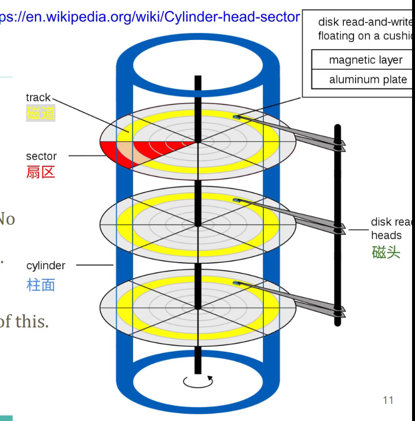

# File System

## 陈硕九讲FS
### Video 1 抽象
#### fs的抽象
FS是一个`Map<string, File>`
```cpp
struct File {
    permissions, type, size, group, user,
    timestamps (ctime, mtime, ...),
    content (bytes)
};
```
#### inode : unix fs的抽象
index node索引节点，通常是32位整数，作为文件访问的bridge。

由`Map<string, File>`的抽象变为`Map<string, inode_num_t> Map<inode_num_t, File>`的抽象

> 例如~/foo/..和~的inode是一样的。会有引用计数，hard-link。

#### disk 的抽象
物理上的扇区（磁盘，扇区可以是block的大小，比如512B）和逻辑上的Block。可以读写。


> 针对寻道，可以想到电梯调度问题。
不用过分优化，就是从外到内寻道，寻道之后直接回到外重新再扫，而不是从外到内从内到外都寻道。为什么，因为“Read-ahead”预读取，读100的时候可能101，102，103都读取到mem了，然后你再读的时候，如果是倒着读，那缓存并不会起到效果。

为什么写入会慢一点，可能需要充磁时间。

