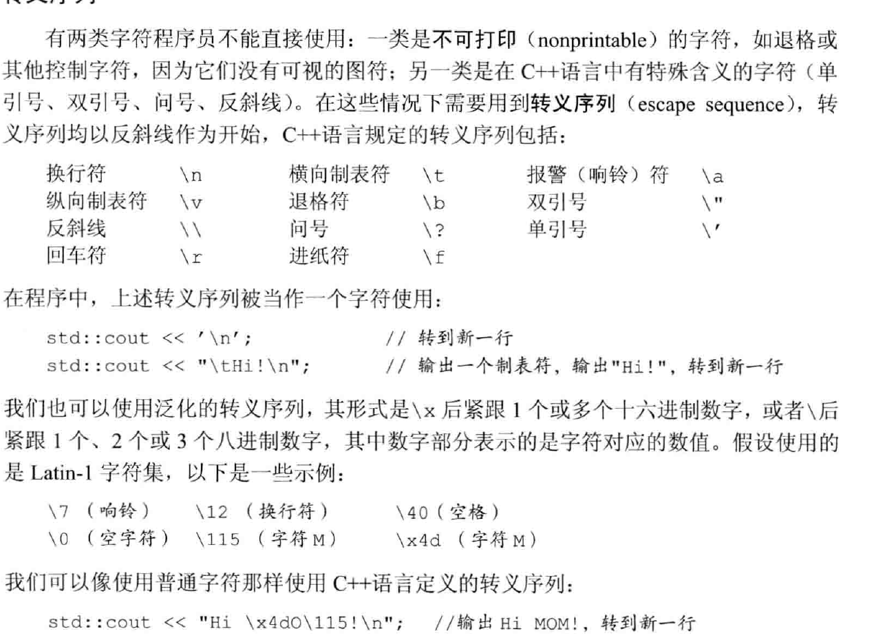
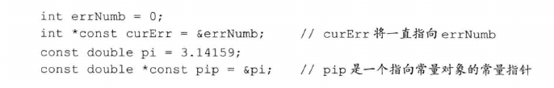

# ch2

## 变量2.2

### 字符串
`"123" "345"`居然可以分开拼串。



### 变量声明和定义分离

#### extern 关键字
```c++
extern int i;//声明主而非定义i
int j;       //声明并定义
```

## 复合类型 2.3

### 引用reference
引用是左值引用，c++11里面有右值引用

引用即为对想起了别名，必须初始化，绑定后无法重新绑定别的对象。

引用本身不是对象，所以不能定义引用的引用

### 指针pointer

指针本身是对象，可以赋值和copy。可以不初始化

空指针`nullptr`，`NULL`是预处理变量，在`cstdlib`，就是0.

`void*`指针，存放任意对象的指针。

`**p ***p`分别是指向指针的指针和只想指针的指针的指针    

## 2.4
### 2.4.2 const and pointer

从右向左看，curErr右边最近的是const，所以是常量指针，然后星号左边是int，指向的是int，所以是个指向int的常量指针。
