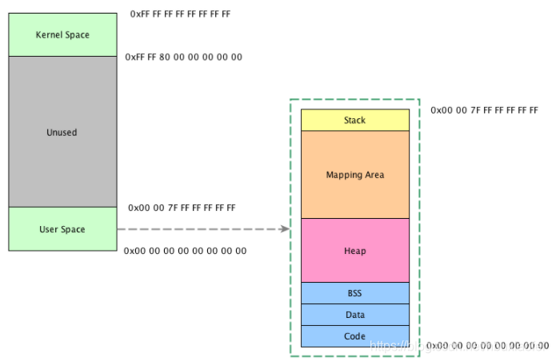
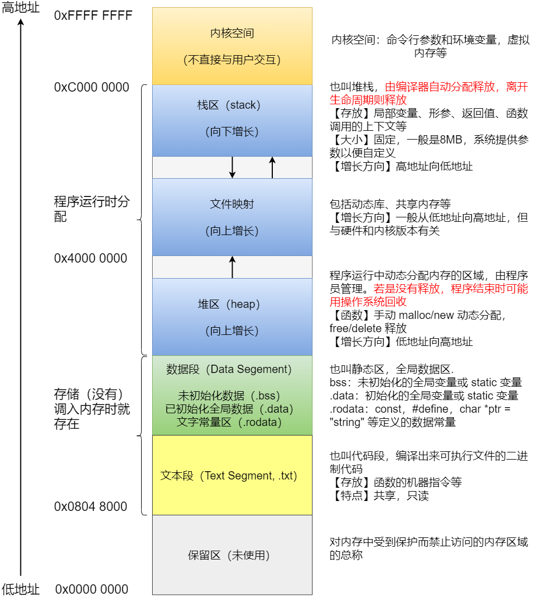

# 进程
## 状态
- [ ] 进程的内存结构
## 组成
PCB，数据段，程序段
task_struct就是PCB的结构，存储在内核空间里面。 
### PCB的主要内容:
1. pid
2. 进程类型
3. 进程状态（运行中，可运行，阻塞中。。。）
4. 进程优先级
5. 调度策略
6. 现场保护区（cpu的pc，寄存器，虚拟地址空间表）
7. 资源需求，分配控制（打开文件的数量，可以创建的进程数量等）
8. 进程的实体信息，进程的是在物理内存中还是在 swap中
9. 指向程序正文，数据以及堆栈所在内存区域的指针
10. 打开的文件描述符表
## 上下文切换
进程，线程，中断上线文切换：

进程上线文切换：

1：虚拟地址空间的切换（1：用户虚拟地址空间：数据段，代码段，堆栈 + 2：内核地址空间：PCB，内核栈）

2：CPU的寄存器，pc等上线文的切换（保存在pcb中）

线程：

1：CPU的寄存器，pc寄存器的上下文切换（保存在pcb中）

中断：

1：CPU的寄存器，pc寄存器的上下文切换（保存在pcb中）

## 内存分布
### 对于64位电脑

内核空间的内存是共享的

bss是未初始化的全局变量，data是初始化的。
mapping area

## 代码
```
join 等待结束
```
## link
[cnblog](https://www.cnblogs.com/PikapBai/p/17577466.html#4-%E8%BF%9B%E7%A8%8B%E5%86%85%E5%AD%98%E5%B8%83%E5%B1%80%E5%86%85%E5%AD%98%E5%88%86%E9%85%8D%E6%96%B9%E5%BC%8F)